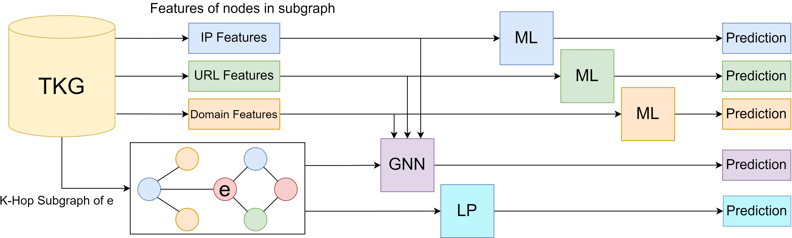

# TRAIL: A Knowledge Graph-based Approach for Attributing Advanced Persistent Threats

## Abstract

Open-source intelligence exchanges provide a rich repository of indicators of compromise (IOCs).
These IOCs are used to build detection signatures and blocklists in production cybersecurity environments as well as prior works.
In this work, we investigate their utility for cyberattack attribution.
To do this, we create a novel system called TRAIL that builds a knowledge graph of network-based IOC co-occurrences in cyberattacks, and their relations to other IOCs.
After analyzing 4,500 cybersecurity events attributed to 22 different advanced persistent threats (APTs), the knowledge graph holds over 2.1 million nodes with 7.9 million edges.
We analyze the knowledge graph this system produces using conventional machine learning, graph analytics, and a graph neural network to quantify the degree to which APTs leave identifiable clues in their IOCs.
Using the TRAIL method to enrich the IOC feature space, IOCs can individually be attributed to the APT that generated them with 45% accuracy.
When attributing groups of IOCs that made up cyberattacks, indirect resource reuse alone accurately attributed 82% of samples.
When we used both graph topology and feature analysis and analyzed events with a graph neural network, attribution accuracy increased to 84%.
Finally, we conducted a 6-month study of new cyber events our models had never seen.
We found that our models continue to achieve similar accuracy on real-world data to what was observed experimentally, so long as the database is no more than 1 month out of date.

## Repository Layout
The relevant files in this repository are listed below. In this section we will detail how to use and run the files necessary to reproduce our work.

```
.
├── TKG.zip/
│   ├── domains.csv
│   ├── ips.csv
│   ├── urls.csv
│   └── full_graph_csr.pt
└── src/
    ├── ml_event_cls.py
    ├── lprop.py
    ├── train_gnn.py
    ├── explain.py
    ├── models/
    │   ├── gnn.py
    │   └── ioc_encoder.py
    ├── build_dataset/
    │   ├── pull.py
    │   └── enrich.py
    └── feature_extraction/
        └── featurizer.py
```

## TKG.zip
This is a zipped directory containing the knowledge graph we used for all of our main experiments. It contains 3 CSV files, holding vectorized features for each IOC. The values of these features (particularly the one-hot features) correlate to values found in the CSVs and .txt files in the `src/feature_extraction/helper_files/` directory. For more information on how these features were derived, please see the subsection on the `src/feature_extraction/` directory. The `full_graph_csr.pt` file contains a PyTorch Geometric Data object that represents the graph. This data object has the following relevant fields:

<h3 style='align="center";'>Table 1: Values in the graph datastructure</h3>

| Key         | Description                                                                                                                                        |
|-------------|----------------------------------------------------------------------------------------------------------------------------------------------------|
| `edge_csr`  | A `src.csr.py:CSR` object holding information about the edges.                                                                                     |
| `feat_map`  | A \|V\|-dimensional pointer to the row in the csv file that holds node data. A value of -1 means no data exists for that node.                     |
| `x`         | A \|V\|-dimensional list of node types. Every value is an integer in the range [0,4]                                                               |
| `ntypes`    | A string to int mapping of node types corresponding with the `x` field. The node types are (in order), ['ips', 'urls', 'domains', 'ASN', 'EVENT']. |
| `event_ids` | The node id of every event node in the TKG.                                                                                                        |
| `y`         | The label of every node in the `event_ids` field                                                                                                   |
| `label_map` | An int to str dictionary mapping the values in `y` to human-readable strings. E.g., `label_map[0] == "APT28"`.                                     |

## Method

